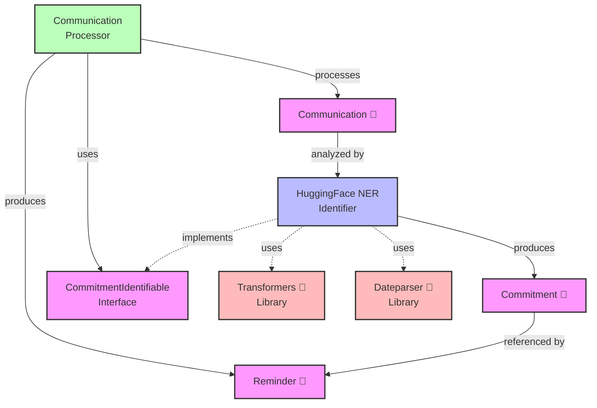
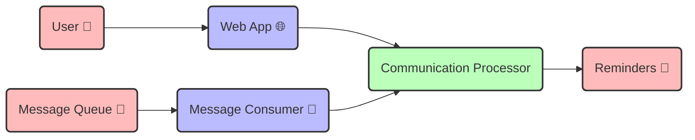

# AuDHD-LifeCoach
I was messaging with a friend the other day around 11:45 and I told them I would come over to their home at 15:30 and give them and their kid a ride to an event. They NEEDED to leave their house at between 15:30 and 16:00. My ADHD brain, however decided in that moment between sending that message and scheduleing my day from that point forward, to changed "arriving at their house at 15:30" to "leaving my house at 15:30" and thus I was very very late. I felt terrible, and while I strive to understand and accept my neurotype and how it is no worse or better than any other neurotype, this kind of Executive Function failure tweaks my internalized ableism badly. I wish I had supports to help with the social aspects of this social disability.

I wish an AI ADHD assistant had been monitoring my messages and had added a reminder to my calendar, or enabled an alarm to tell me to leave at the right time. So I am going to build one! My overall idea is that there would be a process running on my phone that would be listening to what I say all the time and monitoring messages I send to other people and could infer things from this data to automatically add reminders to my calendar, alarms to my clock, and tasks to a ToDo list or other work management tool (think as simple as Keep to as sophisticated as Jira, eventually). 

Eventually, I'd like it to be able to learn about me in particular and get better and better at understanding when I especially need help, nagging, and even some direct assistance ("would you like me to call the mechanic and schedule an oil change? your Mitsubishi is overdue!"). 

I would also like to include support for my various 'fun' autism tendencies such as monitoring the environment, and possibly my metabolic state and warning me if I might be experiencing too much sensory input and might be at risk of meltdown etc.

## Architecture

The AuDHD-LifeCoach application follows a clean architecture approach with clear separation of concerns. The diagram below shows the dependencies between components:



### The Main Components

- **Communications** (📱): Messages you send that might contain commitments
- **Commitments** (🤝): Obligations extracted from your messages (e.g., "meeting at 3PM")
- **Reminders** (🔔): Notifications created to help you keep your commitments

### How It Works

1. Your messages are analyzed to find time-based commitments
2. The system extracts when/where/who details using natural language processing 
3. Reminders are automatically created at appropriate times
4. You get notified before you need to leave for your commitments

This system helps bridge the gap between your intentions (in messages) and your actions (remembering commitments), especially helpful for those of us with executive function challenges!

## System Components

AuDHD-LifeCoach has two main components that run from the same codebase:

1. **Web Application**: Processes HTTP requests for immediate commitment analysis
2. **Message Consumer**: Listens to a message queue for asynchronous processing of communications



## Setup Guide for Developers

### Prerequisites

- [Docker](https://www.docker.com/get-started) and [Docker Compose](https://docs.docker.com/compose/install/)
- Minimum 8GB of free disk space (preferably on D: drive for Windows users)
- Python 3.12+ (for local development without Docker)
- [Poetry](https://python-poetry.org/docs/#installation) (optional, for local development)

### Quick Start with Docker

The simplest way to run AuDHD-LifeCoach is using Docker:

```bash
# Build the Docker image
docker build -t audhd-lifecoach:latest -f Dockerfile.simple .

# Run the application with all services
docker-compose -f docker-compose.simple.yml up
```

This will start:
- The web application on [http://localhost:8000](http://localhost:8000)
- The message consumer service connected to RabbitMQ
- RabbitMQ message broker with management UI on [http://localhost:15672](http://localhost:15672) (login: guest/guest)

> **Note for Windows Users:** The Docker configuration mounts a volume at `D:/HuggingFaceModels` to store large AI model files. Make sure this directory exists or modify the path in `docker-compose.simple.yml` if needed.

### Testing the Message Consumer

To test the message consumer functionality:

```bash
# Send a test message to the queue
python scripts/send_test_message.py "I'll call you at 15:30 tomorrow."
```

You can also customize your message:

```bash
python scripts/send_test_message.py "Your custom message with a commitment"
```

### Local Development Setup

If you prefer to run the application directly on your machine:

1. Install dependencies using Poetry:
   ```bash
   # Install Poetry first if you haven't already
   curl -sSL https://install.python-poetry.org | python3 -
   
   # Install dependencies
   poetry install
   ```

2. Run the web application:
   ```bash
   python -m audhd_lifecoach.main
   ```

3. Run the message consumer:
   ```bash
   python -m audhd_lifecoach.message_consumer_main
   ```

### Project Structure

- `src/audhd_lifecoach/`: Core application code
  - `adapters/`: External integrations (AI, API, repositories)
  - `application/`: Application services and use cases
  - `core/`: Domain entities and interfaces
- `tests/`: Test suite
  - `integration/`: End-to-end and integration tests
  - `unit/`: Unit tests for individual components
- `scripts/`: Utility scripts
  - `send_test_message.py`: Tool for sending test messages to RabbitMQ

### Docker Configuration

This project uses a Docker setup with:
- `Dockerfile.simple`: Contains the build configuration using Poetry
- `docker-compose.simple.yml`: Orchestrates multiple services:
  - `webapp`: Web application service
  - `message-consumer`: Message processing service
  - `rabbitmq`: Message broker service
- `docker-entrypoint.py`: Entry point script for the web application
- `message_consumer_entrypoint.py`: Entry point script for the message consumer

The Docker configuration pre-downloads the necessary Hugging Face models during the build process and stores them in a mounted volume to conserve space.

### Running Tests

```bash
pytest tests/unit
pytest tests/integration
```

## Contributing

Contributions are welcome! Please feel free to submit a Pull Request.
