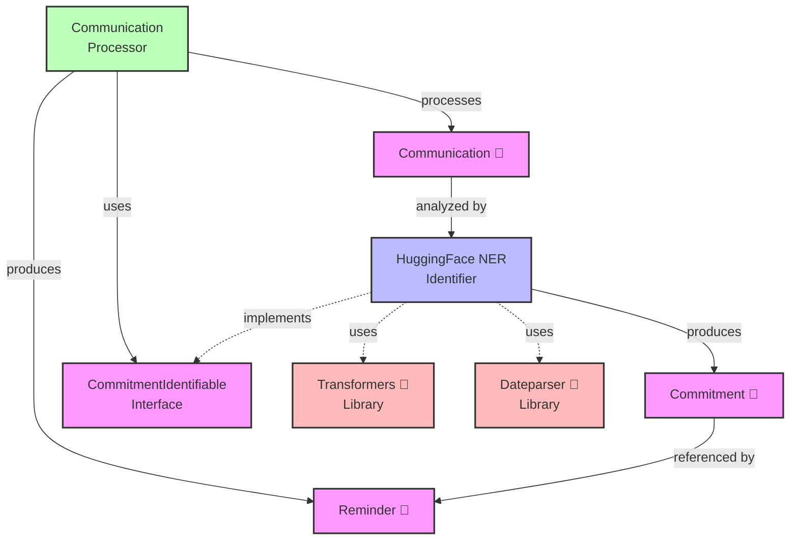
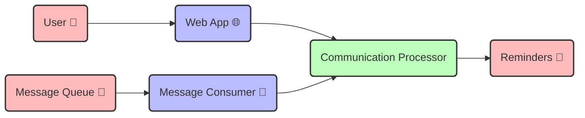

# AuDHD-LifeCoach

[](https://github.com/IzzyFuller/AuDHD-LifeCoach/actions/workflows/ci.yml)
[](https://codecov.io/gh/IzzyFuller/AuDHD-LifeCoach)
[](https://www.python.org/downloads/)
[](https://github.com/psf/black)
[](https://opensource.org/licenses/MIT)

I was messaging with a friend the other day around 11:45 and I told them I would come over to their home at 15:30 and give them and their kid a ride to an event. They NEEDED to leave their house at between 15:30 and 16:00. My ADHD brain, however decided in that moment between sending that message and scheduleing my day from that point forward, to changed "arriving at their house at 15:30" to "leaving my house at 15:30" and thus I was very very late. I felt terrible, and while I strive to understand and accept my neurotype and how it is no worse or better than any other neurotype, this kind of Executive Function failure tweaks my internalized ableism badly. I wish I had supports to help with the social aspects of this social disability.

I wish an AI ADHD assistant had been monitoring my messages and had added a reminder to my calendar, or enabled an alarm to tell me to leave at the right time. So I am going to build one! My overall idea is that there would be a process running on my phone that would be listening to what I say all the time and monitoring messages I send to other people and could infer things from this data to automatically add reminders to my calendar, alarms to my clock, and tasks to a ToDo list or other work management tool (think as simple as Keep to as sophisticated as Jira, eventually). 

Eventually, I'd like it to be able to learn about me in particular and get better and better at understanding when I especially need help, nagging, and even some direct assistance ("would you like me to call the mechanic and schedule an oil change? your Mitsubishi is overdue!"). 

I would also like to include support for my various 'fun' autism tendencies such as monitoring the environment, and possibly my metabolic state and warning me if I might be experiencing too much sensory input and might be at risk of meltdown etc.

## Architecture

The AuDHD-LifeCoach application follows a clean architecture approach with clear separation of concerns. The diagram below shows the dependencies between components:


```mermaid
flowchart TD
    %% Main components
    Communication["Communication 📱"]
    Commitment["Commitment 🤝"]
    Reminder["Reminder 🔔"]
    CommitmentID["CommitmentIdentifiable<br>Interface"]
    HuggingFaceID["HuggingFace NER<br>Identifier"]
    CommProcessor["Communication<br>Processor"]
    TransformersLib["Transformers 🤖<br>Library"]
    DateparserLib["Dateparser 📅<br>Library"]
    
    %% Dependencies
    Communication -->|analyzed by| HuggingFaceID
    HuggingFaceID -->|produces| Commitment
    Commitment -->|referenced by| Reminder
    
    HuggingFaceID -.->|implements| CommitmentID
    CommProcessor -->|processes| Communication
    CommProcessor -->|uses| CommitmentID
    CommProcessor -->|produces| Reminder
    
    HuggingFaceID -.->|uses| TransformersLib
    HuggingFaceID -.->|uses| DateparserLib
    
    %% Styling
    classDef core fill:#f9f,stroke:#333,stroke-width:2px;
    classDef adapter fill:#bbf,stroke:#333,stroke-width:2px;
    classDef service fill:#bfb,stroke:#333,stroke-width:2px;
    classDef external fill:#fbb,stroke:#333,stroke-width:2px;
    
    %% Apply styles
    class Communication,Commitment,Reminder,CommitmentID core;
    class HuggingFaceID adapter;
    class CommProcessor service;
    class TransformersLib,DateparserLib external;
```

### The Main Components

- **Communications** (📱): Messages you send that might contain commitments
- **Commitments** (🤝): Obligations extracted from your messages (e.g., "meeting at 3PM")
- **Reminders** (🔔): Notifications created to help you keep your commitments

### How It Works

1. Your messages are analyzed to find time-based commitments
2. The system extracts when/where/who details using natural language processing 
3. Reminders are automatically created at appropriate times
4. You get notified before you need to leave for your commitments

This system helps bridge the gap between your intentions (in messages) and your actions (remembering commitments), especially helpful for those of us with executive function challenges!

## System Components

AuDHD-LifeCoach has two main components that run from the same codebase:

1. **Web Application**: Processes HTTP requests for immediate commitment analysis
2. **Message Consumer**: Listens to a message queue for asynchronous processing of communications


```mermaid
flowchart LR
    User("User 👤") --> WebApp("Web App 🌐")
    MessageQueue("Message Queue 📨") --> Consumer("Message Consumer 🔄")
    WebApp --> CommProcessor("Communication Processor")
    Consumer --> CommProcessor
    CommProcessor --> Reminders("Reminders 🔔")
    
    classDef component fill:#bbf,stroke:#333,stroke-width:2px;
    classDef processor fill:#bfb,stroke:#333,stroke-width:2px;
    classDef external fill:#fbb,stroke:#333,stroke-width:2px;
    
    class WebApp,Consumer component;
    class CommProcessor processor;
    class User,MessageQueue,Reminders external;
```

## Setup Guide for Developers

### Prerequisites

- [Docker](https://www.docker.com/get-started) and [Docker Compose](https://docs.docker.com/compose/install/)
- Minimum 8GB of free disk space (preferably on D: drive for Windows users)
- Python 3.12+ (for local development without Docker)
- [Poetry](https://python-poetry.org/docs/#installation) (optional, for local development)

### Quick Start with Docker

#### For Production (External Infrastructure)

The production Docker configuration assumes external RabbitMQ infrastructure exists and is managed separately (e.g., by Terraform). You need to provide RabbitMQ connection details via environment variables:

```bash
# Set required environment variables
export RABBITMQ_HOST=your-rabbitmq-host
export RABBITMQ_USERNAME=your-username  
export RABBITMQ_PASSWORD=your-password
export RABBITMQ_PUBLISH_EXCHANGE=audhd_lifecoach
export RABBITMQ_CONSUME_QUEUE=communications

# Build and run the application
docker build -t audhd-lifecoach:latest -f Dockerfile.simple .
docker-compose -f docker-compose.simple.yml up
```

Or use an environment file:
```bash
# Copy and edit the example environment file
cp .env.example .env
# Edit .env with your RabbitMQ settings

# Run with environment file
docker-compose -f docker-compose.simple.yml --env-file .env up
```

#### For Development (Built-in RabbitMQ)

For local development, use the development Docker Compose file that includes a RabbitMQ service:

```bash
# Build the Docker image
docker build -t audhd-lifecoach:latest -f Dockerfile.simple .

# Run with development configuration (includes RabbitMQ)
docker-compose -f docker-compose.dev.yml up
```

This will start:
- The web application on [http://localhost:8000](http://localhost:8000)
- The message consumer service connected to RabbitMQ
- **Development only**: RabbitMQ message broker with management UI on [http://localhost:15672](http://localhost:15672) (login: guest/guest)

> **Note for Windows Users:** The Docker configuration mounts a volume at `D:/HuggingFaceModels` to store large AI model files. Make sure this directory exists or modify the path in the docker-compose files if needed.

> **Note for Production:** The main `docker-compose.simple.yml` assumes external RabbitMQ infrastructure and requires environment variables to be set. Use `docker-compose.dev.yml` for local development with built-in RabbitMQ.

### Testing the Message Consumer

To test the message consumer functionality, you can use the test script which now reads configuration from environment variables:

```bash
# For development (using built-in RabbitMQ from docker-compose.dev.yml)
python scripts/send_test_message.py "I'll call you at 15:30 tomorrow."

# For external RabbitMQ, set environment variables first:
export RABBITMQ_HOST=your-rabbitmq-host
export RABBITMQ_USERNAME=your-username
export RABBITMQ_PASSWORD=your-password
python scripts/send_test_message.py "Your custom message with a commitment"
```

The script will automatically use the configured RabbitMQ settings from your environment.

### Local Development Setup

If you prefer to run the application directly on your machine:

1. Install dependencies using Poetry:
   ```bash
   # Install Poetry first if you haven't already
   curl -sSL https://install.python-poetry.org | python3 -
   
   # Install dependencies
   poetry install
   ```

2. Run the web application:
   ```bash
   python -m audhd_lifecoach.main
   ```

3. Run the message consumer:
   ```bash
   python -m audhd_lifecoach.message_consumer_main
   ```

### Project Structure

- `src/audhd_lifecoach/`: Core application code
  - `adapters/`: External integrations (AI, API, repositories)
  - `application/`: Application services and use cases
  - `core/`: Domain entities and interfaces
- `tests/`: Test suite
  - `integration/`: End-to-end and integration tests
  - `unit/`: Unit tests for individual components
- `scripts/`: Utility scripts
  - `send_test_message.py`: Tool for sending test messages to RabbitMQ

### Docker Configuration

This project includes two Docker configurations:

#### Production Configuration (`docker-compose.simple.yml`)
- **Assumes external RabbitMQ infrastructure** (managed by Terraform/infrastructure team)
- Requires environment variables for RabbitMQ connection details
- No built-in message broker services
- Suitable for production deployments
- Uses `.env` file or environment variables for configuration

#### Development Configuration (`docker-compose.dev.yml`)
- **Includes built-in RabbitMQ service** for local development
- Self-contained for easy local testing
- RabbitMQ management UI available at [http://localhost:15672](http://localhost:15672)
- Uses hardcoded development defaults

#### Configuration Files
- `Dockerfile.simple`: Build configuration using Poetry
- `.env.example`: Template for environment variables
- `docker-entrypoint.py`: Entry point script for the web application
- `message_consumer_entrypoint.py`: Entry point script for the message consumer

The Docker configuration pre-downloads the necessary Hugging Face models during the build process and stores them in a mounted volume to conserve space.

#### Environment Variables

The application uses the following environment variables for RabbitMQ configuration:

| Variable | Description | Default | Required |
|----------|-------------|---------|----------|
| `RABBITMQ_HOST` | RabbitMQ hostname | `localhost` | Yes |
| `RABBITMQ_PORT` | RabbitMQ port | `5672` | No |
| `RABBITMQ_USERNAME` | RabbitMQ username | `guest` | Yes |
| `RABBITMQ_PASSWORD` | RabbitMQ password | `guest` | Yes |
| `RABBITMQ_VIRTUAL_HOST` | RabbitMQ virtual host | `/` | No |
| `RABBITMQ_CONSUME_QUEUE` | Queue name for consuming | `communications` | No |
| `RABBITMQ_PUBLISH_EXCHANGE` | Exchange name for publishing | `audhd_lifecoach` | No |
| `RABBITMQ_CONNECTION_ATTEMPTS` | Connection retry attempts | `3` | No |
| `RABBITMQ_RETRY_DELAY` | Delay between retries (seconds) | `2` | No |
| `RABBITMQ_CONNECTION_TIMEOUT` | Connection timeout (seconds) | `30` | No |
| `RABBITMQ_HEARTBEAT` | Heartbeat interval (seconds) | `600` | No |

### Running Tests

The project includes comprehensive test coverage with both unit and integration tests:

```bash
# Run all tests
poetry run pytest

# Run only unit tests
poetry run pytest tests/unit

# Run only integration tests  
poetry run pytest tests/integration

# Run tests with coverage reporting
poetry run pytest --cov=src/audhd_lifecoach --cov-report=term --cov-report=html

# Generate coverage badge
poetry run coverage-badge -o coverage.svg

# Use convenient scripts (Windows)
.\scripts\generate_coverage.ps1

# Use convenient scripts (Unix/Linux/Mac)
python scripts/generate_coverage.py
```

**Current Test Coverage:** 81% 📊

The test suite includes:
- **Unit Tests**: Test individual components in isolation
- **Integration Tests**: Test the complete communication-to-reminder flow
- **Mocked External Dependencies**: All external services (RabbitMQ, AI models) are mocked for reliable testing

### Continuous Integration

The project uses GitHub Actions for CI/CD with the following pipeline:
- **Multi-Python Testing**: Tests on Python 3.10, 3.11, and 3.12
- **Code Quality**: Runs Black, isort, flake8, and mypy
- **Coverage Reporting**: Uploads coverage to Codecov
- **Docker Build**: Validates Docker image builds on main branch
- **Dependency Caching**: Speeds up builds with Poetry cache

## Contributing

Contributions are welcome! Please ensure your code:
- Uses **Poetry for dependency management** (not pip directly)
- Follows the existing code style (Black + isort)
- Includes appropriate tests
- Maintains or improves test coverage
- Passes all CI checks

**Development Workflow:**
```bash
# Install dependencies
poetry install

# Run tests
poetry run pytest

# Run linting
poetry run black src/ tests/
poetry run isort src/ tests/
poetry run flake8 src/ tests/

# Run type checking
poetry run mypy src/

# Generate coverage report
poetry run pytest --cov=src/audhd_lifecoach --cov-report=html
```

Please feel free to submit a Pull Request.
