# AuDHD-LifeCoach
I was messaging with a friend the other day around 11:45 and I told them I would come over to their home at 15:30 and give them and their kid a ride to an event. They NEEDED to leave their house at between 15:30 and 16:00. My ADHD brain, however decided in that moment between sending that message and scheduleing my day from that point forward, to changed "arriving at their house at 15:30" to "leaving my house at 15:30" and thus I was very very late. I felt terrible, and while I strive to understand and accept my neurotype and how it is no worse or better than any other neurotype, this kind of Executive Function failure tweaks my internalized ableism badly. I wish I had supports to help with the social aspects of this social disability.

I wish an AI ADHD assistant had been monitoring my messages and had added a reminder to my calendar, or enabled an alarm to tell me to leave at the right time. So I am going to build one! My overall idea is that there would be a process running on my phone that would be listening to what I say all the time and monitoring messages I send to other people and could infer things from this data to automatically add reminders to my calendar, alarms to my clock, and tasks to a ToDo list or other work management tool (think as simple as Keep to as sophisticated as Jira, eventually). 

Eventually, I'd like it to be able to learn about me in particular and get better and better at understanding when I especially need help, nagging, and even some direct assistance ("would you like me to call the mechanic and schedule an oil change? your Mitsubishi is overdue!"). 

I would also like to include support for my various 'fun' autism tendencies such as monitoring the environment, and possibly my metabolic state and warning me if I might be experiencing too much sensory input and might be at risk of meltdown etc.

## Architecture

The AuDHD-LifeCoach application follows a clean architecture approach with clear separation of concerns. The diagram below shows the dependencies between components:

```mermaid
%%{init: {"theme":"forest", "themeCSS": "g.classGroup rect { stroke-width: 2px; stroke-dasharray: 5; } .relations { stroke-width: 1.5px; stroke-dasharray: 5 5; } text { font-family: 'Comic Sans MS', cursive; font-size: 14px; } g.classGroup text { font-weight: normal; } .node rect { stroke-width: 2px; stroke-dasharray: 5; } .clusters rect { stroke-dasharray: 5; }", "flowchart": {"curve": "basis"}}}%%

flowchart TD
    %% Main components with XKCD style
    Communication["Communication 📱"]
    Commitment["Commitment 🤝"]
    Reminder["Reminder 🔔"]
    CommitmentID["CommitmentIdentifiable<br>Interface"]
    HuggingFaceID["HuggingFace NER<br>Identifier"]
    CommProcessor["Communication<br>Processor"]
    TransformersLib["Transformers 🤖<br>Library"]
    DateparserLib["Dateparser 📅<br>Library"]
    
    %% Dependencies using XKCD style lines
    Communication -->|analyzed by| HuggingFaceID
    HuggingFaceID -->|produces| Commitment
    Commitment -->|referenced by| Reminder
    
    HuggingFaceID -.->|implements| CommitmentID
    CommProcessor -->|processes| Communication
    CommProcessor -->|uses| CommitmentID
    CommProcessor -->|produces| Reminder
    
    HuggingFaceID -.->|uses| TransformersLib
    HuggingFaceID -.->|uses| DateparserLib
    
    %% Styling
    classDef core fill:#f9f,stroke:#333,stroke-width:2px,stroke-dasharray: 5 5;
    classDef adapter fill:#bbf,stroke:#333,stroke-width:2px,stroke-dasharray: 3 3;
    classDef service fill:#bfb,stroke:#333,stroke-width:2px,stroke-dasharray: 5 2;
    classDef external fill:#fbb,stroke:#333,stroke-width:2px,stroke-dasharray: 2 2;
    
    %% Apply styles
    class Communication,Commitment,Reminder,CommitmentID core;
    class HuggingFaceID adapter;
    class CommProcessor service;
    class TransformersLib,DateparserLib external;
```

### The Main Components

- **Communications** (📱): Messages you send that might contain commitments
- **Commitments** (🤝): Obligations extracted from your messages (e.g., "meeting at 3PM")
- **Reminders** (🔔): Notifications created to help you keep your commitments

### How It Works

1. Your messages are analyzed to find time-based commitments
2. The system extracts when/where/who details using natural language processing 
3. Reminders are automatically created at appropriate times
4. You get notified before you need to leave for your commitments

This system helps bridge the gap between your intentions (in messages) and your actions (remembering commitments), especially helpful for those of us with executive function challenges!
